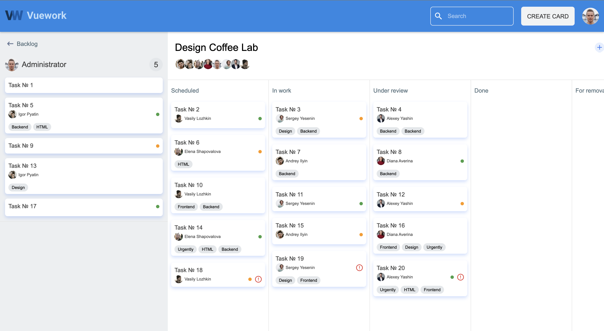

# «VueWork: Task Manager»



___

## Requirements
- Docker
- NodeJS >= 16
- GNU Make

### Install project dependencies

`make install_project_dependencies`

### Start project

`make start_project`

___

## Endpoints

Server `localhost:3000`

Client `localhost:8080`

Documentation (OpenAPI)  `localhost:3000/explorer/`

___

## Configurations

Database connection configuration for the server in a file `backend/src/datasources/database.datasource.ts`

### Authorized user login

To log in (login) to the system, use the following data:

```
email: user@example.com
password: user@example.com
```

You can change the user data in the file `backend/src/factory/users.json`

### Launching and viewing the finished layout of the project

`make install_template_dependencies`
