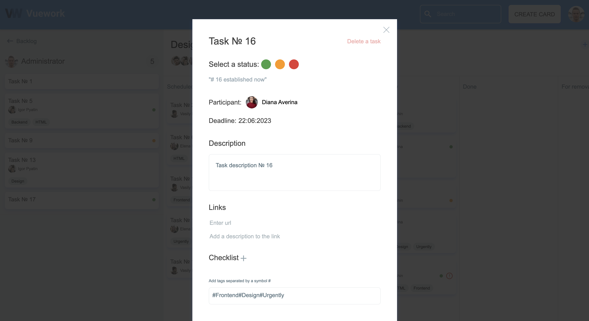

# «VueWork: Task Manager»




___

## Requirements
- Docker
- NodeJS >= 18
- GNU Make

### 1. Install project dependencies

`make install_project_dependencies`

### 2. Start project

`make start_project`

___

## Endpoints

Server `localhost:3010`

Client `localhost:8090`

Database `localhost:5434`

Documentation (OpenAPI)  `localhost:3010/explorer/`

___

## Configurations

Database connection configuration for the server in a file `backend/src/datasources/database.datasource.ts`

### Authorized user login

To log in (login) to the system, use the following data:

```
email: user@example.com
password: user@example.com
```

You can change the user data in the file `backend/src/factory/users.json`
